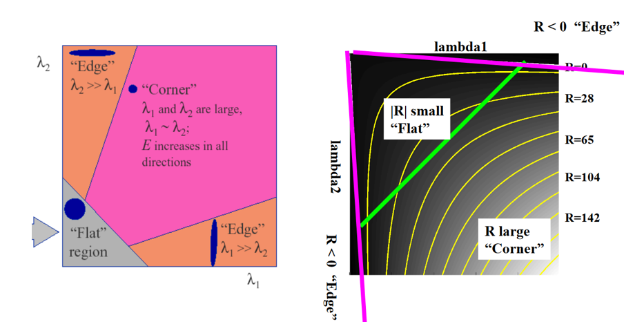
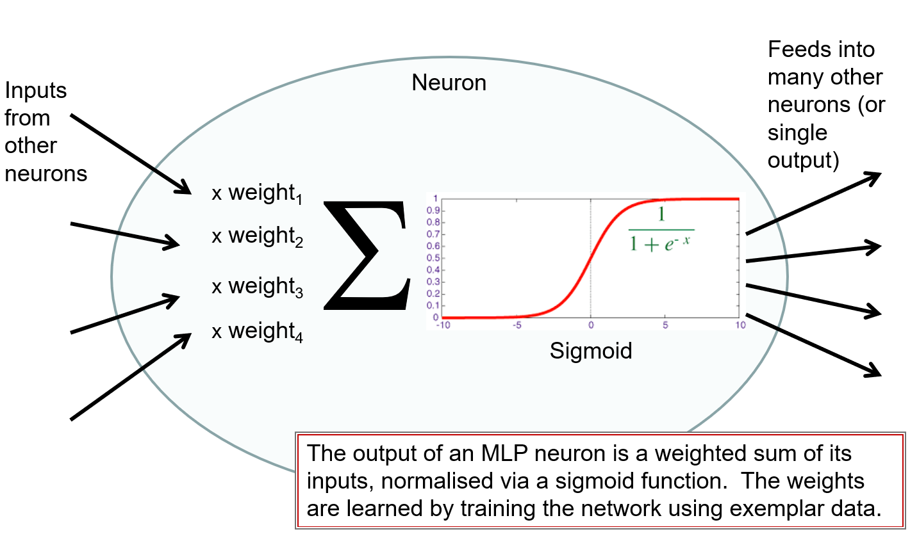

# Notes on EEE3032 Computer Vision and Pattern Recognition

emal: zhouyi1023@tju.edu.cn
# Lecture 1 Introduction to Computer Vision

* Bottom-up Processing:
    * Low Level : e.g. edge detection
    * Mid Level : e.g. connect edge pixels to form region; shape analysis
    * High Level : e.g. analyse region adjacency; ==semantics/rules== for combination of regions 
* Top-down Processing: Fit a model to the raw data
    * Fitness function
    * Heuristic constraints
    * Optimization
* Hybrid: simplify the top-down fitting problem by doing some preliminary bottom-up analysis


Methodology:
* Heuristic: encode our intellgience/prior knowledge of how to solve problems
* Learning: by example

---

# Lecture 2 Image Processing (part 1)
RGB colour to greyscale (Y) 
$Y = 0.30 R + 0.59G + 0.11B$

Gaussian noise:
* Speckling caused by thermal noise
* Cheap cameras in low-light conditions 
* Averaging images to remove

Convolution = Rotation 180 + Correlation

An edge is an intensity discontinuity in an image:


ideal: step-edge; finite difference

practical: noisy edge
Sobel filter: smoothing the imagr slightly prior to detecting edges


---

# Lecture 3 Image Processing (part 2)

## Discrete Fourier Transform 
2D DFT
$F(u,v)=\frac{1}{MN}\displaystyle\sum_{x=0}^{M-1}\sum_{Y=0}^{N-1}f(x,y)e^{-2\pi i(ux/M+vy/N)}$
2D IDFT
$f(x,y)=\displaystyle\sum_{x=0}^{M-1}\sum_{Y=0}^{N-1}F(u,v)e^{2\pi i(ux/M+vy/N)}$

==TODO:2D Spectrum==

## Convolution Theorem
$F[f*h] = F[f]F[h]$

## Low-pass Filter
Box filter(Mean filter)
Gaussian filter
$G_{\sigma} = \frac{1}{2\pi\sigma^2}e^{-\frac{x^2+y^2}{2\sigma^2}}$

* The FT of a box is a sinc scaled according to the size of the box
* The FT of a Gaussian of s is a Gaussian of 1/s


The “Ideal” low pass filter is $sinc (x) = sin(x)/x$, but sinc is an  oscillating infinite series and thus cannot be represented in digital images, because they have compact support

A truncated sinc signal in spatial filter creates artifacts in the frequency domain and thus ringing artifacts in the image. 

A Gaussian is infinite but “well behaved”

### Sharpening 
$F+\alpha(F-F*H) = F+\alpha(F*(I-H)) $


$\nabla^2 G(x,y)$
suppresses both high and low frequencies
the FT of LoG is a LoG

### Edge Detection
Derivative of Gaussian


Convolution is associative

$\frac{d}{dx}(f*h) = f * \frac{d}{dx}(h)$

(differentiation is also kind of convolution)

combine smoothing/differentiation: 
differentiates the image in one direction and smoothes in the orthogonal direction

the first order partial derivative of Gaussian:


Approximations:
* Sobel Operator
Approximation of derivative of Gaussian
$\begin{bmatrix}
1 & 0 & -1\\
2 & 0 & -2\\
1 & 0 & -1
\end{bmatrix} = \begin{bmatrix}
1 \\
2 \\
1 \end{bmatrix}
\begin{bmatrix}
1 & 0 & -1
\end{bmatrix}
$
* Prewitt Operator
$\begin{bmatrix}
1 & 0 & -1\\
1 & 0 & -1\\
1 & 0 & -1
\end{bmatrix} = \begin{bmatrix}
1 \\
1 \\
1 \end{bmatrix}
\begin{bmatrix}
1 & 0 & -1
\end{bmatrix}
$

Canny edge detection
1. Filter image with derivative of Gaussian
2. Find magnitude and orientation of gradient
3. Non-maximum suppression
4. Hysteresis thresholding()
    * Select the pixels such over high threshold
    * Collect the pixels above low threshold that are neighbours of already collected edge points


---

# Lecture 4 Introduction to Pattern Classification
### Machine Learning：
* Supervised Classification
* Unsuprevised Classification
    * No training examples are given 

### Problems：
* Overfitting
    * too specific to training data
    * can’t generalise sufficiently
* Underfitting
    * classifier is not inferring a sufficiently detailed model  
    * too general
    * learns non-discriminative or non-desired pattern

### Distance Measurement:
* Euclidean distance (L2 norm)
* Manhattan distance (L1 norm)
* $\alpha$ norm
$L_{\alpha} = \Big(\sum_i |p_i-q_i|^{\alpha}\Big)^{\frac{1}{\alpha}}$

### Voronoi Diagram
a partition of a plane into regions close to each of a given set of objects.


## Result Evaluation
### Confusion Matrix:
Multi-label Classifier

The figures show the confusion matrix with and without normalization by class support size (number of elements in each class). This kind of normalization can be interesting in case of class imbalance to have a more visual interpretation of which class is being misclassified.


### Receiver Operator Characteristic (ROC) Curve
* x-axis False Positive Rate
$\frac{FP}{FP+TN}$
* y-axis True Positive Rate 
$\frac{TP}{TP+FN}$ i.e. Recall
* diagonal line: random guess
* doesn't affect by imbalance data (each metric use only one label data to measure)


### Example：Sky Segmentation
RGB Feature Space
Threshold Euclidean Distance
Spherical Decision Boundary

---

# Lecture 5 Pattern Classification (Eigenmodels, part 1)
## 2D Transformation Matrix
### Interpretation of a rotation matrix
* The representation of a point in two frames (e.g. sensor frame, PCA)
It represents a coordinate transformation relating the coordinates of a point p in two different frames
* The relationship between two frames (including all points in the frame e.g. robot manipulator)
It gives the orientation of a transformed coordinate frame with repsect to a fixed coordinate frame
* The transformation of a vector in the same frame(e.g. image warping)
It is an operator taking a vector and rotating it into a new vector in the same coordinate system

### Different kinds of transformation
* Pure rotation
$\begin{bmatrix}
x' \\ 
y'
\end{bmatrix} = 
\begin{bmatrix}
cos\theta & -sin\theta \\
sin\theta & cos\theta
\end{bmatrix} \cdot
\begin{bmatrix}
x \\
y
\end{bmatrix}
$
 
*  Scaling along principal axis
$\begin{bmatrix}
x' \\ 
y'
\end{bmatrix} = 
\begin{bmatrix}
s_x & 0 \\
0 & s_y
\end{bmatrix} \cdot
\begin{bmatrix}
x \\
y
\end{bmatrix}
$
* Scaling along specific axis
 $\begin{bmatrix}
x' \\ 
y'
\end{bmatrix} = 
\begin{bmatrix}
cos\theta & sin\theta \\
-sin\theta & cos\theta
\end{bmatrix} \cdot
\begin{bmatrix}
s_x & 0 \\
0 & s_y
\end{bmatrix} \cdot
\begin{bmatrix}
cos\theta & -sin\theta \\
sin\theta & cos\theta
\end{bmatrix} \cdot
\begin{bmatrix}
x \\
y
\end{bmatrix}
$

Tips: if M is orthonormal, $M^{-1} = M^T$
## Eigenvalue and Eigenvector
$Av = \lambda v$
$det(A-\lambda I) =0 $

$A\cdot V = V \cdot D$
$A = VDV^T$
where D is a diagonal matrix of eigenvalues and V is a matrix whose columns are the corresponding eigenvectors

Different eigenvectors (columns of V) are orthonormal to each other, which can be considered as a set of basis vector

## Eigenmodel
* Step 1: Arrange n (for example, 2 dimensional) data vector into matrix
$x = \begin{bmatrix}
x_1 & x_2 & x_3 & ... & x_n \\
y_1 & y_2 & y_3 & ... & y_n
\end{bmatrix}
$
* Step 2: Calculate the mean in each dimension
* Step 3: Calculate the covariance matrix
$C = \frac{1}{n}(x-\mu)(x-\mu)^T$
* Step 4: Decompose the covariance matrix using EVD
```matlab
[V,D] = eig(C)
```
---

# Lecture 6 Pattern Classification (Eigenmodels, part 2)
The Eigenmodel allows us to extract features from data 
For classification problem, we need to define a distance
## Mahalanobis Distance
Intuitions:
Non-uniform distribution of training data, thus we need an ellipsoid decision boundary.

To measure the ditribution, we use variance (1-D) / covaraince (N-D)
* The eigenvectors form a data-dependent basis set (orthonormal)
* The eigenvalues tell us how much variance there is along each corresponding eigenvector.

Thus measure distance in units of standard deviation using Mahalanobis distance 

Process:
1. Substract mean, get a vector in centroid spheroid frame $x := x- \mu$
2. project vector into in centroid ellipsoid frame by $V(x-\mu)$
one point in two frames problem
suppose the new coordinate at eigenvector frame is denoted by $x'$
$Vx' = x, x' = V^{-1}x = V^T x$

3. penalize the standard deviation, by $D^{-1}x'$, then the vector is in a centroid spheroid again
4. to get a distance function we use 
$(D^{-1}V^T(x-\mu))^T D^{-1}V^T(x-\mu)$
$= (x-\mu)^TVD^{-T}D^{-1}V^T(x-\mu)$
5. $D^{-T}D^{-1} = D^{-1}D^{-1} = U^{-1}$ is the matrix of eigenvalue
Covariance matrix is given by 
$C = VUV^T, C^{-1} = VU^{-1}V^T$

6. the Mahalanobis distance is given by
$d^2 = (x-\mu)^TC^{-1}(x-\mu)$


## Principal Component Analysis
* Inutuition: 
    * deal with Curse of Dimensionality
    * some features are correlated

* Process:
    * Step 1: Extract the eigenvalues and eigenvectors of the covariance matrix
    * Step 2: Select top percentage of eigenvalues, up to say 97% of trace
    * Step 3: Drop the null space of eigenvector matrix to get K 
    Notice that K is not square but it columns represent orthonormal basis, thus we can get
    $q =  K^{-1} p = K^T p$


---

# Lecture 7 Features and Matching

Descipter should be discriminative and compact
## Task Definition of Visual Search:
* We have:
    * a database of images
    * algorithm to represent the images 
    * algorithm to calculate similarity score
* Preprocess:
    * represent every image in database into N-dimensional descriptors
    * we can directly use the descriptors to replace the images
* Input: a query image
* Process:
    * represent the image in feature space
    * calculate the distance score from other images in database
* Output: ranked images based on similarity score 

## Methods:
### 1. Global Color (-Only) Histogram
RGB space is quantitized into bins
Normalized the results to get the distribution

suppose $q$ bins for every color channel, then $q^3$ bins in total
each pixel is represented by a vector $[r_q, g_q, b_q]$ 
$r_q,g_q,b_q \isin [0, q-1]$

Notice [0,0,q-1] is completely different from [0,1,0]

encode the vector into a single number in base $q$, different numbers represent independent dimensions

Then there are $q^3$ bins in total
We make a histogram with x-axis as the index of bin, and y-axis as the number of pixels fall in to this bin

Finally, we could encode the histogram into a 1 dimensional vector with $q^3$ entries for each image.

### 2. Grid + Color + PCA 
Intuition: add some spatial information (add one dimension, to get a 2 dimensional desciptor)

Decompose the image into $x \times y$ cells, and concatenate each descriptor to form a descriptor with size of $(x \cdot y) \times q^3$ (column vector).  Do some dimension reduction through PCA

Project data to basis of first N eigenvectors 

Then, we can represent the images in a reduced feature space. 
When a new query comes, we can calculate the Distance from every images in database.


### 3. Edge Orientation Histogram
Intuition: texture/edges are discriminitive
use Sobel filter to calculate the edge orientation 
Only count orientations from strong edges
Quantize orientation into 8 bins
Then, the same process as above

### 4. EOH + Mean Color
Intuition: use spatial distribution of both edeges and color

Concatenate  two vectors to formulate a joint desciptor, finally ,calculate the Euclidean distance.

### Limitations of Grid Methods
* Coarse grids do not precisely cover the object -> poor discrimination
* Fine grids yield many cells-> poor compactness
* Grids are sensitive to translation, rotation, and scaling of objects


## Semantic Gap
How to define similarity?
* Level 1: Similar low-level features (texture, colour)
* Level 2: Similar semantic contents (object, activity)
* Level 3: High-level concepts (war, comedy, news)

CBIR = Content Based Image Retrieval (visual search is a form of CBIR)

## Evaluating Visual Search
‘top N’ results: 
For every query image, compute the metric based on the correctness of the top N most similar images


Precision Recall Curve


$AP = \frac{\sum_{n=1}^{M}P(n)\times rel(n)}{N}$
where M is the datasize, N is the total number of relevent documents

MAP is AP averaged over all queries

Precision – Recall  is the best option to evaluate Level 1 similarity

When retrieval is based on presence of categories (e.g. Level 2 semantic contents) the problem is one of supervised classification – use confusion matrix.

---

# Lecture 8 Features and Matching (part I)

## Harris Corner Detector
Intuition: if we move a small observing window,
* In the flat region, there will be no change in all directions
* In the edge, the motion along the edge cannot be identified
* In the corner, the pattern inside will change in all direction

The difference can be described by auto-correlation of the patch


$\sum_w [I(x+u,y+v)- I(x,y)]^2$

take the first order Taylor expansion of $I(x+u,y+v)$, then arrange the formula into matrix form

$\sum_w [I(x,y) + uI_x +vI_y- I(x,y)]^2$

$= \begin{bmatrix}
u & v
\end{bmatrix} \cdot
\Big(\sum_w
\begin{bmatrix}
I^2_x & I_xI_y \\
I_xI_y & I^2_y
\end{bmatrix}\Big) \cdot
\begin{bmatrix}
u  \\
v
\end{bmatrix} 
$

denotes the covariance matrix as $M$, which is also called Harris matrix, also mathematically called structure tensor  

Efficient computation:  Det (M)  >> Trace (M)
R-score =  Det(M) – k$\cdot$Trace(M)$^2$  = $\lambda_1\lambda_2 - k (\lambda_1+\lambda_2)^2$
[Harris recommends k=0.04]
* Big R indicates corner
* Negative R indicates edge
* Small R indicates flat region


* Rotation Independent
* Scale Dependent

### Harris Detector for retrieval
form a local window around each feature
use descriptor to represent the patch

## K-means Clustering
Unsupervised Clustering
k is the prior parameter

Process:
* step 1: Choose k initial centroids at random
* step 2: Compute point-to-cluster-centroid distances of all observations to each centroid
* step 3: Two ways to proceed
    * Batch update — Assign each observation to the cluster with the closest centroid.
    * Online update — Individually assign observations to a different centroid if the reassignment decreases the sum of the within-cluster, sum-of-squares point-to-cluster-centroid distances.
* step 4: Compute the average of the observations in each cluster to obtain k new centroid locations.
* step 5: Repeat steps 2 through 4 until cluster assignments do not change, or the maximum number of iterations is reached.

The results may fail due to
* poor choice of k
* poor choice of initial centriods

---

# Lecture 9 Features and Matching (part II)

## Bag of Visual Words (BoVW) pipeline:
1. Feature extraction
    * regular grid
    * interest point detector
2. Describe the point and assembly into feature space
3. Clustering is a common method for learning a codebook(visual vocabulary) 
    * Use K-means to quantize the feature space into k bins
4. Represent images by codeword(visual word) frequency histogram 

## Scale Invariant Feature Transform (SIFT)
* SIFT is robust, i.e. affine invariant (rotation and scale invariant)
    * Robust to 60 degrees viewpoint change
    * Robust to 2x scale change
    * Partial robust to illumination change
* SIFT can be used as both detector and desciptor 

SIFT descriptor:
1. Divide the 16x16 (pixel) window into a 4x4 grid 
2. Compute the orientation histogram (8 oritentation bins) in each grid cell
3. Concatentate histograms to form descriptor ($4 \times 4 \times 8 = 128$ dimensions) 

### SIFT Process
1. Scale-space Extrema Detection
SIFT algorithm uses Difference of Gaussians which is an approximation of LoG. Difference of Gaussian is obtained as the difference of Gaussian blurring of an image with two different $\sigma$, let it be $\sigma$ and $k\sigma$. This process is done for different octaves of the image in Gaussian Pyramid.
$k=2^\frac{1}{s}$
为了在每组中检测S个尺度的极值点，DOG金字塔每组需S+2层图像，因为DOG金字塔的每一层和其上下两层比较得到极值点，第一层和最后一层是不能检测极值点的，而DOG金字塔由高斯金字塔相邻两层相减得到，则高斯金字塔每组需S+3层图像。
在检测极值点前对原始图像高斯平滑会丢失高频信息，所以 在建立尺度空间前首先对原始图像长宽扩展一倍，以保留原始图像信息，增加特征点数量。


Once this DoG are found, images are searched for local extrema over scale and space. One pixel in an image is compared with its 8 neighbours as well as 9 pixels in next scale and 9 pixels in previous scales. If it is a local extrema, it is a potential keypoint.

2. Keypoint Localization
* Remove low-contrast keypoints 
Taylor series expansion of scale space to get more accurate location of extrema, and if the intensity at this extrema is less than a threshold value (0.03 as per the paper), it is rejected.

* Remove edge keypoints
DoG has higher response for edges. A 2x2 Hessian matrix (H) to compute the principal curvature. Its two eigenvalue are proportional to principal curvatures. If the ratio is greater than a threshold, that keypoint is discarded. 
$ H = \begin{bmatrix}
I_{xx} & I_{xy} \\
I_{yx} & I_{yy} \\
\end{bmatrix}$

3. Orientation Assignment
An orientation is assigned to each keypoint to achieve invariance to image rotation. An orientation histogram with 36 bins covering 360 degrees is created
Histogram entries are weighted by (i) gradient magnitude and (ii) a Gaussian function with $\sigma$ equal to 1.5 times the scale of the keypoint. The radius of the circle is $3\sigma$

The highest peak in the histogram is taken and any peak above 80% of it is also considered to calculate the orientation.(About 15% of keypoints has multiple orientations assigned.Significantly improves stability of matching.)

4. Keypoint Descriptor
In order to achieve orientation invariance, the coordinates of the descriptor and the gradient orientations are rotated relative to the keypoint orientation.

16x16 window -> 4x4x8 = 128 dimensional feature

5. Keypoint Matching
* Pair off descriptors, closest first 
* Any points that don’t map directly back –> discard
* If the second-closest distance is < 1.4 x closest-distance -> discard

## Matching Descriptors
* Pair off descriptors, closest first
* Any points that don’t map directly back –> discard
* If the second-closest distance is < 1.4 x closest-distance -> discard

## SVM
The objective of the support vector machine algorithm is to find a hyperplane in an N-dimensional space that distinctly classifies the data points by maximizing the margin distance

Binary SVC

Multi-class SVC


---

# Lecture 10 Shape Representation I
## Line Parameterisation
$y=mx+c$ what if x = K -> infinite gradient iof vertical lines
represent in $(\theta, r)$
$r = x\cos(\theta)+ y\sin(\theta)$
where $\theta \in (-\pi/2, \pi/2]$, $r\in R$ 

$r = \sqrt{x^2+y^2}sin(\theta+\phi)$ is a sinusoidal curve
where $\tan(\phi) = \frac{x}{y}$


## Hough Transformation
### Lines
For each edge pixel in the image find all lines $(r,\theta)$ passing through it
Parameter space divided into cells which act as vote counters 
Choose a good grid / discretization
==Lines of finite length?==
1. Initialize $H[r, \theta]=0$
2. for each edge point $I[x,y]$ in the image
   for $\theta = [\theta_{min}  :  \theta_{max} ]$  // some quantization
    $r = x\cos(\theta)+ y\sin(\theta)$
    $H[r, \theta] += 1$
3. Find the value of $(r, \theta)$ where $H[r, \theta]$ is maximum
4. The detected line in the image is given by $r = x\cos(\theta)+ y\sin(\theta)$

Extension: select $\theta$ as the estimated gradient at (x,y) to reduces degrees of freedom


### Circles
$r^2 = (x-a)^2 + (y-b)^2$

For every edge pixel (x,y) : 
For each possible radius value r:
For each possible gradient direction θ: 
// or use estimated gradient at (x,y)
$a = x + r cos(θ)$ // column
$b = y - r sin(θ)$  // row
$H[a,b,r] += 1$
	end
end

### Generalized Hough Transform
Define a model shape by its boundary points and a reference point.
Offline procedure:
* At each boundary point, compute displacement vector: $r = a – pi$
* Store these vectors in a table indexed by gradient orientation $θ$

Detection procedure:
For each edge point:
* Use its gradient orientation $θ$ to index into stored table 
* Use retrieved $r$ vectors to vote for reference point


### Pros & Cons
Pros
* All points are processed independently, so can cope with occlusion, gaps
* Some robustness to noise: noise points unlikely to contribute consistently to any single bin
* Can detect multiple instances of a model in a single pass

Cons
* Complexity of search time increases exponentially with the number of model parameters 
* Non-target shapes can produce spurious peaks in parameter space
* Quantization: can be tricky to pick a good grid size


## Create Masks for Connected Components
### flood fill
Assume image = binary mask of connected components
Recursive algorithm 
```
floodFill (x,y, colour) {
	oldcolour=get (x,y);
	set (x,y)=colour;

	if (get(x-1,y) == oldcolour and not colour)
		floodFill (x-1,y,colour);
	if (get(x+1,y) == oldcolour and not colour)
		floodFill (x+1,y,colour);
	if (get(x,y-1) == oldcolour and not colour)
		floodFill (x,y-1,colour);
	if (get(x,y+1) == oldcolour and not colour)
		floodFill (x,y+1,colour);
}

for y=1 to image.height  {
    for x=1 to image.width  {

	if image.get(x,y)==white {

	      image.floodfill (x,y,grey);
	      workingmask= image.mask(grey);

	      <analyse workingmask>

	      image.floodfill (x,y,black);

	    }

    }
}
```

``` python
# A recursive function to replace  
# previous color 'prevC' at '(x, y)'  
# and all surrounding pixels of (x, y)  
# with new color 'newC' and  
def floodFillUtil(screen, x, y, prevC, newC): 
      
    # Base cases 
    if (x < 0 or x >= M or y < 0 or 
        y >= N or screen[x][y] != prevC or 
        screen[x][y] == newC): 
        return
  
    # Replace the color at (x, y) 
    screen[x][y] = newC 
  
    # Recur for north, east, south and west 
    floodFillUtil(screen, x + 1, y, prevC, newC) 
    floodFillUtil(screen, x - 1, y, prevC, newC) 
    floodFillUtil(screen, x, y + 1, prevC, newC) 
    floodFillUtil(screen, x, y - 1, prevC, newC) 

```

## Shape Descriptor
a feature representing the shape of a region or contour
discriminative and compact
* region-based shape desciptor
    * shape factors
    * hu-moments
* contour(boundary)-based shape descriptor


## Region-based Shape Desciptors
### 1.shape factor

* orientation shape factor:
build a eigenmodel of all white pixels
orientation corresponds to two eigenvector
* extent shape factor
==shape factor = length/width = ratio of eigenvalues==
because it is dense, thus we need to calculate integer to get variancce

### 2. statistical moments
#### Moments

Moments are statistical measures computed about a constant

$\alpha^{th}$ moment about zero is

$m_{\alpha} = \frac{\sum_{x=1}^Nx^{\alpha}f(x)}{\sum_{x=1}^Nf(x)}$

zero-th moment $m_0 = 1$
mean is the first moment computed about zero $m_1$

#### Central moments
Central moments are moments computed about the mean, which better represent the shape of distribution
* 1D Case

$\alpha^{th}$ central moment is

$\mu_{\alpha} = \frac{\sum_{x=1}^N(x-\mu)^\alpha f(x)}{\sum_{x=1}^Nf(x)}$

$\alpha=1$ -> 0
$\alpha=2$ -> variance, spread about mean
$\alpha=3$ -> skewness, balanced about mean

---

# Lecture 11 Shape Representation II

* 2D Case: useful in shape description

2D moments about zero 

$m_{ij} = \frac{\sum_{x=1}^W\sum_{y=1}^Hx^iy^if(x,y)}{\sum_{x=1}^W\sum_{y=1}f(x,y)}$

$m_{1,0} = \mu_{x}, m_{0,1} = \mu_{y}$

2D central moments

$\mu_{ij} = \frac{\sum_{x=1}^W\sum_{y=1}^H(x-\mu_x)^i(y-\mu_y)^if(x,y)}{\sum_{x=1}^W\sum_{y=1}^Hf(x,y)}$

$\mu_{01} = \mu_{10} = 0; \mu_{11}=1$


## Seven Hu Moments
affine invariant shape descriptors
  

## Shape Descriptors for Classification
* 7 Hu Moments as feature
* Use Eigenmodels (or even SVMs) to classify
* Use a confusion matrix to evaluate

## Morphological Operators
### Erode

### Dilate


The effect of one does not reverse the other
* A dilation followed by an erosion is a “closure”
* An erosion followed by a dilation is an “opening”
* Boundary(I) = Dilate(I) – Erode(I)

---

# Lecture 12 Shape Representation III
## Contour-based Shape Descriptor
### Chain Code
can be used in compression and gesture recognition 

* [x] represent all shape
* [x] invariant to translation
* [ ] invariant to rotation
* [ ] invariant to scale

Start-point invariant chain codes
* Computing the first difference(FD) of a chain code
* Try every rotation of the chain code to find ==smallest integer FD==
* Not the same as rotational invariance. 

### Central Distance Fourier Descriptor
1. sampling the contour as theta varies
2. calculate distance to the centroid 
3. FFT of the distance array
4. return the first n magnitude

Fourier Descriptors are generative
1. inverse FFT to get d
2. recreate the shape from the signal and visualise

most of the information is in the lower frequencies
It is unusual to use more than the first 16 or so frequency bins

* [ ] represent all shape
* [x] invariant to translation
* [x] invariant to rotation
* [ ] invariant to scale


### Angular Fourier Descriptor
can handle concave polygon

open shapes: loop back

Problem: the discontinuity between 0 and $2\pi$:
compensate by running a(n) through a cosine function (dot product of two normalized vectors)


* [x] represent all shape
* [x] invariant to translation
* [x] invariant to rotation
* [ ] invariant to scale

---

# Lecture 13 Tracking I
## Background Substraction
per pixel mean over frames
object binary mask = threshold(current frame - background frame)
## Blob Tracking
* color model of target object
(eigen model)
* use the model to find target and create a mask
* use the centroid

problem: multiple connected components (e.g. hands)

## Nearest Neighbour Tracking
based on distance
no temporal information

problem: 
* clutter: distractors -> discriminative
* occlusion -> motion model

## Template Tracking
search all positions in the frame for the presence of template
* cross correlation
    * sum of squared differences (SSD)
    * normalized cross correlation (NCC)
    substract mean to give some invariance to illumination change
    Pearson coefficient [-1,1]
* thershold 
* nearest neighbour

problem: over longer sequences, apperance changes

---

# Lecture 14 Tracking II
color histogram or edge orientation histogram -> affine invariant

## Kalman filter

* Restricted to Gaussian densities
* Uni-modal distribution: single hypothesis
* Only linear, continuous dynamic model


---

# Lecture 15 Tracking III
## Bayes Theorem
$P(Y|X) = \frac{P(X|Y)P(Y)}{P(X)} = \frac{P(X|Y)P(Y)}{P(X|Y)P(Y)+P(X|\bar Y)P(\bar Y)}$

Recursive Bayesian Filter

## Particle Filter
* Nonlinear dynamic 
* Multi-modal and therefore non-Gaussian
* Multiple samples provides multiple hypotheses

### 1. select

### 2. predict
* First, an element undergoes drift and, since this is deterministic, identical elements in the new set undergo the same drift.
* The second predictive step, diffusion, is random and identical elements now split because each undergoes its own independent Brownian motion step.

### 3. measure

### 4. propagate

### 5. result


## Belief


## CONDENSATION
CONditional DENSity PropagATION
first introduce particle filter into computer vision
Probabilistic framework for tracking objects such as curves in clutter
* The problem is to track outlines and features of foreground objects, modelled as curves, as they move in substantial clutter, and to do it at, or close to, video frame-rate.
* This is challenging because elements in the background clutter may mimic parts of foreground features.
* In the most severe case of camouflage, the background may consist of objects similar to the foreground object, for instance, when a person is moving past a crowd.
* Kalman Filter work relatively poorly in clutter which causes the density for xt to be multi-modal and therefore non-Gaussian。


---

# Lecture 16-17 Convolutional Neural Networks
## Training
Each iteration of training using all data is an “epoch”
A “batch” (sometimes “minibatch”) of data (e.g. 100 examples) is chosen at random from all training data – it usually takes several batches to train an epoch

The batch size is a number of samples processed before the model is updated.
* Batch Gradient Descent. Batch Size = Size of Training Set
* Mini-Batch Gradient Descent. 1 < Batch Size < Size of Training Set. A good default for batch size might be 32.
* Stochastic Gradient Descent. Batch Size = 1. However, SGD almost always actually refers to mini-batch gradient descent.

Feature scaling

```(image - image.mean()) / (image.std() + 1e-8)```

PCA/Whiten


The training set of CIFAR-10 is of size 50,000 x 3072, where every image is stretched out into a 3072-dimensional row vector. We can then compute the [3072 x 3072] covariance matrix and compute its SVD decomposition (which can be relatively expensive). 


Learning Curve
* the validation loss should converge (but is usually higher than) the training loss
* loss can help us adjust learning rate, or indicate when to stop training
* continued training of a good fit will likely lead to an overfit.

(do not confused with the learning curve(high bias high/variance) whose x axis is datasize)

* Optimization Learning Curves: Learning curves calculated on the metric by which the parameters of the model are being optimized, e.g. loss.
* Performance Learning Curves: Learning curves calculated on the metric by which the model will be evaluated and selected, e.g. accuracy.


## Layer Architecture
### MLP
Neuron

The output of an MLP neuron is a weighted sum of its inputs, normalised via a sigmoid function.  
$h_{\theta}(x) = \frac{1}{1+e^{-\theta^T x}}$
### Convolution Neural Network
AlexNet consists of 5 Convolutional Layers and 3 Fully Connected Layers


#### Convolution layer

#### ReLU (rectified linear units) layer
ReLu is fundamental to a CNN’s ability to learn complex functions – breaks associativity of successive convolutions
$R(z) = max(0,z)$

#### Max pooling layer

#### Fully connected layer 
“FC layer” = “inner product layer” = “dense layer”

#### Softmax layer
sigmoid binary classification
Softmax is kind of Multi Class Sigmoid, but if you see the function of Softmax, the sum of all softmax units are supposed to be 1.
$S(z_j) = \frac{e^{z_j}}{\sum_{k=1}^K e^{z_k}}$

### Batch Normalization
Batch normalization is a technique for training very deep neural networks that standardizes the inputs to a layer for each mini-batch. 

* deal with internal covariate shift
* use before(more popular) or after the activation function
* cannot be applied on small batch
* do not use batch normalization and dropout in the same network

Training:

Testing:


* less covariate shift, larger learning rate
* less exploding/vanishing gradients especially for sigmoid, tanh.etc
* less affected by weight initialization
* reduce the demand for regularization

---

# Lecture 18 Contours, Curves and Splines
spline: a piecewise polynomial (parametric) curve
## Parametric Curve
piecewise curve modelling
$x = x_0 + sx_1 + s^2x_2 + s^3x_3$
$y = y_0 + sy_1 + s^2y_2 + s^3y_3$

$p(s) = \vec{x}_0+s\vec{x_1}+s^2\vec{x_2}+s^3\vec{x_3}$
$=\begin{bmatrix}
\vec x_3 & \vec x_2 & \vec x_1 & \vec x_0
\end{bmatrix}\cdot\begin{bmatrix}
s^3\\
s^2\\
s\\
1
\end{bmatrix}$

$p(s) = GMQ(s)$

where $G$ is the geometry matrix; $M$ is the blending matrix
Blending functions specify how to blend the values of the control point vector


Curve Continuity: $C^n$ continuity
## Hermite Curve

To calculate M:

$Q' = \begin{bmatrix}
3s^2\\
2s\\
1\\
0
\end{bmatrix}
$

$\begin{cases}
p(0) = GMQ(0)\\
P(1) = GMQ(1)\\
P'(0) =  GMQ'(0)\\
P'(1) =  GMQ'(1)\\
\end{cases}
$

## Bezier Curve


## Cardinal Spline

A cardinal spline section is completely specified with four consecutive control-point positions. The middle two control points are the section endpoints, and the other two points are used in the calculation of the endpoint slopes.

Control points: $p_{k-1}, p_k, p_{k+1}, p_{k+2}$

$P(0) = p_k \newline P(1) = p_{k+1} \newline P'(0) = \frac{1}{2}(1-t)(p_{k+1}-p_{k-1}) \newline P'(1) = \frac{1}{2}(1-t)(p_{k+2}-p_k) $

Parameter t is called the tension parameter because it controls how loosely or tightly the cardinal spline fits the input control points

When t = 0, this class of curves is referred to as Catmull-Rom splines


## Catmull-Rom Spline
Use N-1 piecewise curves to interpolate N control points with C1


## B-Spline
approximates all control points with C1 (this can be useful to smooth noisy control points)

The B-spline curve section starts at a position near p1 and ends at a position near p2

$P(0) = \frac{1}{6}(p_0+4p_1+p_2) \newline P(1) = \frac{1}{6}(p_1+4p_2+p_3) \newline P'(0) = \frac{1}{2}(p_2-p_0) \newline P'(1) = \frac{1}{2}(p_3-p_1) $


The magnitude of the second derivative is the curvature

## Frenet Frame
1. Tangent
$T = p'(s) = \frac{\delta p(x)}{\delta s}$
2. Normal
$N = p''(s) = \frac{\delta p'(x)}{\delta s}$
3. Binormal
$B = b(s) = p'(s) \times p''(s)$


---


# Lecture 19 Shape: Active Contours
## Snakes
Snakes are piecewise curves that are iteratively fitted to image data by moving their control points 

* A smooth 2D curve which matches to image data
* Initialized near target, iteratively refined
* Can restore missing data

$E =\int_{s=0}^{s=1} \alpha|\frac{dP(s)}{ds}|+\beta|\frac{dP^2(s)}{ds^2}|+\gamma I(P(s))ds$
$=E_{elastic}+ E_{curvature} + E_{external}$

where $\alpha$ regularizes control point spacing
$\beta$ controls curvature
$\gamma$ encourages the curve to cover edge pixels

* Low weight on $\alpha$  
spacing between points can be irregular. This can lead to loss of accuracy
Larger α increases stiffness of curve

* Low weight on $\beta$
curvature can be very high. This can lead to sharp discontinuities in curves and doubling back

* Low weight on $\gamma$ 
image has little influence over internals. The snake doesn’t fit the underlying data very well


$E_{elastic} = \displaystyle\sum_{i=0}^{n-1} (x_{i+1}-x_i)^2 + (y_{i+1}-y_i)^2-\bar d$
$E_{curvature} = \displaystyle\sum_{i=0}^{n-1} (x_{i+1}-2x_i+x_{i-1})^2 + (y_{i+1}-2y_i+y_{i-1})^2$

external could also be gradient-based
$E_{external} = -\displaystyle\sum_{i=0}^{n-1}|G_x(x_i,y_i)|^2+|G_y(x_i,y_i)|^2$

The first two internal terms are functions of the curve’s shape
The final external term is based on the image content 


optimize by gradient descent


### Williams / Shah fitting
greedy search
allow corners/discontinuities 
1. For each control point, in turn, move the control point to the location in its 3x3 neighbourhood minimising E
2. If all the follow criteria are met, set $\beta$ to zero at the control point
a. curvature at control point larger than both its neighbours 
b. curvature at control point is larger than a basic threshold  
c. edge strength at control point is above threshold

## Point Distribution Model(PDM)
build a statistical shape model from a set of contours using an Eigenmodel
A major issue using PDMs with images is need to create correspondence between control points


### Procrustes Analysis
align a pair of edge maps by translating, rotating and uniformly scaling one shape to match the other
1. Translate the object’s centroid to align with that of the model
2. Rotate the model to minimize the Sum of Square Differences (SSD)
3. Scale the model to minimize the Sum of Square Differences (SSD)

## Active Shape Model(ASM) 
an active contour (snake) where control point movement is governed by a PDM

We assume we have an initial estimate for the pose and shape parameters (eg the mean shape). This is iteratively updated as follows:
1.  Look along normals through each model point to find the best local match for the model of the image appearance at that point (eg strongest nearby edge)
2. Update the pose and shape parameters to best fit the model instance to the found points
3. Repeat until convergence 

perform gradient descent in the Eigenmodel space


The performance can be significantly improved using a multi-resolution implementation, in which we start searching on a coarse level of a gaussian image pyramid, and progressively refine. This leads to much faster, more accurate and more robust search. 


## Tracking
1. Use final contour/model extracted at frame  t  as an initial solution for frame t+1
2. Evolve initial contour to fit exact object boundary at frame t+1
3. Repeat, initializing with most recent frame.


---

# Lecture 19 Segmentation I
# Top-down vs bottom-up segmentation
* Top-down: pixels belong together because they are from the same object
* Bottom-up: pixels belong together because they look similar

Bottom-up segmentation via clustering– Algorithms: 
* Mode finding and mean shift: k-means, EM, mean-shift
* Graph-based: normalized cuts 
Segmentation Cues:
* color
* texture
* motion
* depth
## Binary segmentation
### global thresholding
color eigenmodel + mahalanobis distance
* object (white/1)    
* non-object / background (black/0)
### dynamic thresholding
sliding window 
threshold relative to pixel value within the window
works on any data where low-freq variation is undesired
do some morphological operations 

## Multi-label: Split and Merge
* SPLIT
Repeatedly split image into regions until each region is sufficiently homogeneous (e.g. variance below some threshold)：==QuadTree==

* MERGE
For each leaf of the tree, check if it can be merged with other leaves and retain variance below threshold. It mitigates over-splitting

## Segmentation via K-Means
* RGB
lacks any spatial coherence
over-segmentation and rough region boundaries
* RGBXY
pixels with similar colours AND similar locations would group together  

## Mean Shift
Finding modes in a set of data samples, manifesting an underlying probability density function (PDF)
The mean shift algorithm seeks modes or local maxima of density in the feature space

1. Pick k points (means) to act as cluster centres, just like k-means
2. For each point, compute density in a small local window
3. Shift the point (mean) in direction of gradient(center of mass) until convergence, i.e. the center of circle coincide with the center of mass
4. If windows of two points overlap enough, merge those means into one mean.

Mean shift clustering/segmentation
1. Find features (color, gradients, texture, etc)
2. Initialize windows at individual feature points
3. Perform mean shift for each window until convergence
4. Merge windows that end up near the same “peak” or mode

The window (kernel) used in Mean Shift could have any form so long as the area under it sums to 1, e.g. rectangle and Gaussian

Parzan function:
A function of some finite number of data points x1…xn 
(xi is a multi-dimensional constant data point)
$f(x) = \frac{1}{n}\displaystyle\sum_{i=1}^n K(x-x_i)$
using the kernal as
$K(x-x_i) = ck(||\frac{x-x_i}{h}||^2)$
where h is the bandwidth i.e. range of the kernel; xi is the mean
$\nabla f(x) =  \frac{1}{n}\displaystyle\sum_{i=1}^n \nabla K(x-x_i) \newline = \frac{c}{n}(\sum g_i)(\frac{\sum x_ig_i}{\sum g_i}-x)$

where $g = -k'(x)$

$\vec m_h(x)=\frac{\sum_{i=1}^ng(\frac{||x-x_i||^2}{h}) x_i}{\sum_{i=1}^ng(\frac{||x-x_i||^2}{h})}-x$


Flat regions induce the modes
Feature space : Joint domain = spatial coordinates(x-y plane) + grey-level color space(z-axis)


## Berkeley Methodology

Precision:  The fraction of boundary pixels in the machine image that are “correct” i.e. also boundaries in the ground truth

Recall:  The fraction of ground truth boundaries that are returned as boundaries in the machine image.

Compute P-R for several experimental conditions of your algorithm 
* $Precision = \frac{TP}{TP+FP}$ 
* $Recall = \frac{TP}{TP+FN}$ 


F-measure (F1 score): harmonic mean of precision and recall
$F_1 = 2\frac{P\cdot R}{P+R}$


---

# Lecture 20 Segmentation
Binary segmentation: 
* foreground: source
* background: sink
## Min Cut
Images as graphs：
* node (vertex) for every pixel
* link between every pair of pixels
* affinity weight for each link (edge)

The cost of a cut is the sum of weights (similarities) removed by the cut

$cut(A,B) = \displaystyle\sum_{p\in A, q\in B}c_{p,q}$
where A and B are point sets lying in the two sides of the cut.$c_{p,q}$ is the capacity.

Find a cut to minimize 


Weight of cut proportional to number of edges in the cut; tends to produce small, isolated components.


## Normalized Min Cut
Fix bias of Min Cut by normalizing for size of segments

$Ncut(A,B) = \frac{cut(A,B)}{volume(A)} + \frac{cut(A,B)}{volume(B)}$

volume(A) means sum of all edge weights that touch A


## Graph Cut in practice
* hard constraint: The user scribbles on the foreground and background. 


likelihood of each pixel’s colour being part of the foreground or background
Using all scribbled pixels to build a colour model, then calculate 
Mahalanobis distance 
### cost
$E(f) = \displaystyle\sum_{p\in P}D_p(f_p)+\displaystyle\sum_{p,q\in N}V_{p,q}(f_p,f_q)$

where $f$ denotes the labelling choice of the pixel, $p,q$ is the pixels 
$V_{p,q}$ is the pairwise term, i.e. the cost of the cut
$D_p$ is the unary term. The sum of the distance of pixels labelled FG actually belonging to that FG colour model.  (And similarly for BG pixels and the BG model)

The graph cut concept generalises to multi-label segmentation


---

# Lecture 20 Establishing Correspondence
## Homogeneous Coordinates
rotation about arbitary point:
1. translate frame so that the rotation centroid is into origin
2. rotation $\theta$ degree
3. translate back
$p^\prime = 
\begin{bmatrix}
1 & 0 & c_x\\
0 & 1 & c_y\\
0 & 0 & 1
\end{bmatrix}\begin{bmatrix}
\cos\theta & -\sin\theta & 0\\
\sin\theta & \cos\theta & 0\\
0 & 0 & 1
\end{bmatrix}\begin{bmatrix}
1 & 0 & -c_x\\
0 & 1 & -c_y\\
0 & 0 & 1
\end{bmatrix}p
$
## Transformation
* linear: rotation ,shear, scaling
* affine: linear + translation
* projective


* Affine Fitting (2D)
$M = \begin{bmatrix}
m_{11} & m_{12} & m_{13}\\
m_{21} & m_{22} & m_{23}\\
0 & 0 & 1
\end{bmatrix}
$
6 unknowns, 3 pairs of correponding points

Another Classification (3D):


### RANSAC
RANdom Sampling And Consensus
1. Select a subset of the data d from D
2. Generate model M from d that well explains d
3. Test M’s accuracy over all of D
4. If the accuracy isn’t good enough, iterate back to 1 up to MAXITER times

Apply RANSAC to fit contours to images
we could just repeatedly guess 3 point correspondences, derive an M, and after so many iterations, use the best estimate for M so far, i.e. contour configuration that overlaps the most edge pixels

## Homography
2D-2D transformation
$H = \begin{bmatrix}
h_1 & h_2 & h_3\\
h_4 & h_5 & h_6\\
h_7 & h_8 & 1
\end{bmatrix}
$
8 unknowns, 4 pairs of correponding points


### SVD
extract eigenvectors $V$, and the coefficients $US$ to reconstruct the data

$A=USV^T$
$A: m\times n$
$U: n\times r$:orthonormal left singular vectors
$S: r\times r$ diagonal sigular value matrix; r is rank of A
$V: n \times r$: orthonormal right singular vectors

$A^TA = VS^TSV^T$
$AV = US$

* The eigenvectors of $A^TA$ make up the columns of $V$ 
* The eigenvectors of $AA^T$ make up the columns of $U$
* The singular values in $S$ are square roots of eigenvalues from $A^TA$ or $AA^T$ 

Applications:
* for least square problem $Ax = 0$, take SVD of A, the solution is the right eigenvector $V$ corresponding to the minimum eigenvalue (L2 norm is the sum of variance)
* for m data vectors, the covariance is $C = \frac{1}{m}\sum_{i=1}^m(x^i - \bar x) = \frac{1}{m}XX^T$, then take SVD of X, the data can be projected into the eigenvector by $U^TX$

### Feature matching
Measure difference as Euclidean distance between feature vectors
1. Pick the nearest neighbor. Threshold on absolute distance
Problem: Lots of self similarity in many photos
2. Nearest neighbor distance ratio between distances to the nearest and 2nd nearest neighbors
Sorting by this ratio puts matches in order of confidence

Even when pick best match, still lots (and lots) of wrong matches due to outliers

### RANSAC for Mosaicing
Least square esitmation is not robust to outliers
Two-stage process:
1. Classify data points as outliers or inliers
2. Fit model to inliers while ignoring outliers

RANSAC
1. Pick 4 points from the left image at random and find their correspodence in the right image
2.  Derive the homography H 
3. Measure the forward-backward transfer error E(H) 
$E(H) = \sum_{i=1}^N|Hp_i-q_i|+|H^{-1}q_i-p_i|$
Points that match within a certain distance are called inliers (the rest, outliers)
4. Repeat until 
* inlier ratio reaches expected ratio of inliers
* max iterations N reached 

Number N of samples required to ensure, with a probability p, that at least one random sample produces an inlier set that is free from “real” outliers for a given s and e
$1-(1-(1-e)^s)^N = p$
$N = \frac{log(1-p)}{log(1-(1-e)^s)}$ 
where 
N = number of samples
e = probability that a point is an outlier (proportion of outliers)
s = number of points in a sample
p = desired probability that we get a good sample e.g. p = 0.99


### Depth Parallax
Homography will only align the dominant plane in each image
Not everything can be aligned by a single plane-plane transformation


---

# Lecture 21 Markov Process
## Markov Process 
If the current state of a system can be predicted by its previous state, then it is a Markov process (1st order)

## Markov Model 
* Initial state probabilities 
* Transition probabilities

## Hidden Markov Model
cannot directly observe the states
* Initial state probabilities 
* Transition probabilities 
* Emission probabilities
### Viterbi Algorithm

### Optical Character Recognition


---

# Lecture 22-23 Camera Geometry
## Euler Angle
Gimbal lock
the loss of one degree of freedom in a three-dimensional when the axes of two of the three gimbals are driven into a parallel configuration


## Pin-hole Model

Field of view is inverse proportionalt to focal length

$u=\frac{d}{z}x+c_x\newline v=\frac{d}{z}y+c_y$

## Perspective Projection


## Visual Hull
If we work out which voxels are occupied by a person/object then we will have produced a 3D model.  We call this the visual hull.
```
For each voxel (x,y,z) in the capture volume
	Let counter=0
	For each calibrated camera
		Project (x,y,z) to (u,v)
		If (u,v) is set, then counter =counter+1
	End
	If counter == total cameras, then voxel is part of hull
End
```
## Triangulation
Given a pair of 2D points, captured with calibrated cameras
The 3D point is at the intersection of the two rays


---

# Lecture 24 Multi-View Geometry
## Epipolar Geometry


## Fundamental Matrix & Essential Matrix


## Finding F – The 8 Point Algorithm

use 8 pairs of corresponding points between a pair of images 

use SVD to get the least square solution

## RANSAC for Fundamental Matrix
1. Pick 8 points from the left image at random
2. Using pre-computed matches, find 8 corresponding points in the right image
3. Derive the fundamental matrix F from these 8 pairs of corresponding points
4. Measure the forward-backward transfer error E(F) between all points using F. Points that match within a certain distance are called inliers (the rest, outliers)
5. Repeat until max iterations reached or log(1-p)/log(fraction of outliers). Where p=desired probability of a result having no outliers e.g. 0.99.

---

# Lecture 25 Camera Calibration
## Step 1: 2D-3D Correspondence


## Step 2: Recover K

## Step 3: Recover R and T

## Step 4: Reprojection Error

## Overall Process

## Stereo Rectification


---

# Lecture 26 Surface Capture 
## Camera Calibration
get intrinsics K and recover radial distortion
## Wand Based Calibration
An Eigenmodel in RGB space yields a good mask of the marker

## RANSAC fitting of circular model
1. Run edge detection over binary mask and threshold
2. Pick 3 edge pixels at random
3. Compute centre of circle whose circumference touches all three of the points
4. Count up the number of pixels the fitted circle passes through
5. Repeat a large number of times and use the circle parameters (a,b,r) that maximise the count in 4

## Pairwise Calibration
Find the extrinsics for the cameras in a pairwise fashion
1. Compute F using correspondences between views
2. Rearrange F and K to get E
3. Decompose E to get extrinsics R and T.

## Global Bundle Adjustment


## Computing the silhouette
An Eigenmodel can be trained using the blue background.  
An appropriate threshold on the Mahalanobis distance can be determined via ROC curve analysis on a few sample frames.
## Computing the visual hull
```
For each voxel (x,y,z) in the capture volume
	Let counter=0
	For each calibrated camera
		Project (x,y,z) to (u,v)
		If (u,v) is set, then counter =counter+1
	End
	If counter >=threshold * , then voxel is part of hull
End
* Threshold might be set between 60-100% of camera count
```
## Meshing the Hull
The voxel model is converted into a mesh model using Marching Cubes
* For each cube, we have 8 vertices with 2 possible states each (inside or outside).
* This gives us 28 possible patterns = 256 cases.
* Use symmetries to reduce problem from 256 to 15 cases.

* Use vertex bit mask to create an index for each case based on the state of the vertexes. 
* Use index to lookup list of edges intersected.

* Use densities to interpolate edge intersections

* Determine surface normal
Surface normals need to be determined for shading
    * calculate normal for each cube vertex
    * interpolate the normals at the vertices of the triangles

* Output the triangle vertices and vertex normals

## Texturing the Mesh
Each polygon is assigned a piece of texture cut from one of the camera’s images.
* Rays are projected from each polygon in the direction of the surface normal.
* The dot project of the normal with the camera optical axis reveals the camera most directly facing the polygon.
* Simple depth tests confirm the visibility of each camera


